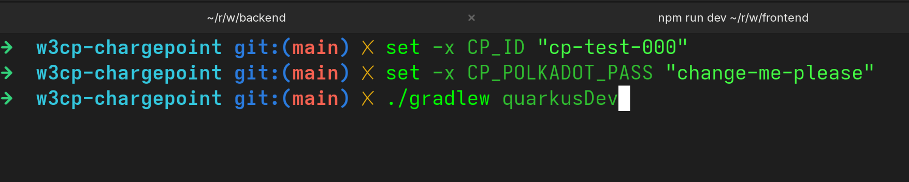
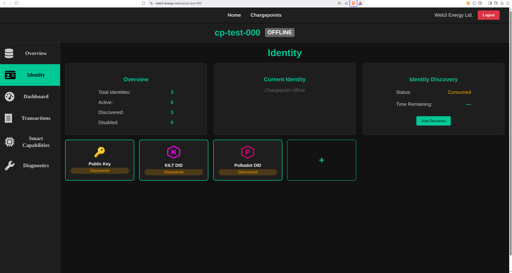
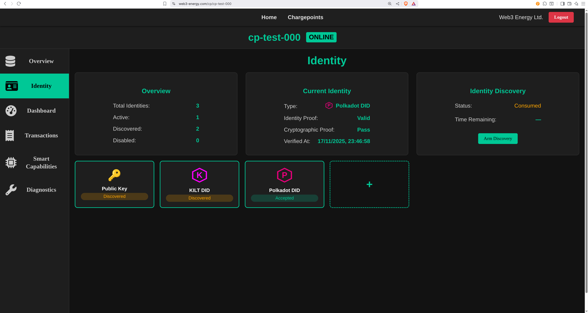
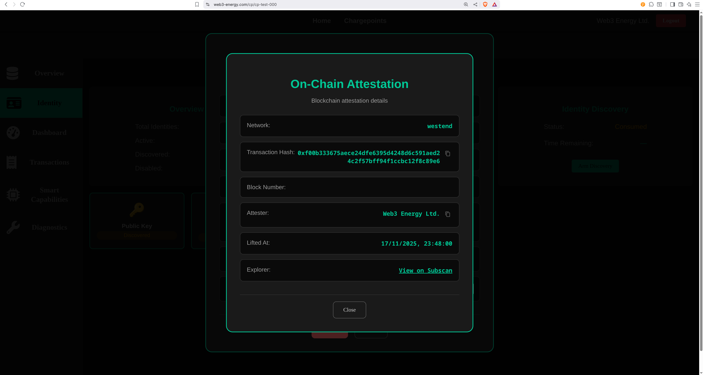

# Web3-Energy Demo — W3CP Protocol + Polkadot Identity Lift

This repository contains the **official hackathon demo** for  
**Web3-Energy** — a next-generation, identity-first EV charging ecosystem powered by Web3, decentralized identity, and modern cloud infrastructure.

It includes:

- **`w3cp-chargepoint/`** – a simple Charge Point emulator to test W3CP connections  
- **`sidecar/`** – the Polkadot signer service used by the backend to *lift* a Charge Point identity on-chain

The live Proof-of-Concept (PoC) is already deployed and running on AWS:

👉 **https://web3-energy.com**

Access to the backend and frontend source code can be granted on request,  
but is **not required** to test this demo.

---

## 🌍 Vision — Why This Matters

Today’s EV ecosystem relies on outdated protocols (OCPP) and fragmented identity models.  
Charge points use weak identifiers, backend operators rely on static configuration, and trust is based on proprietary certificates rather than open, verifiable identity.

**We believe EV charging needs a fundamental upgrade:**

- **Device-level identities must be decentralized.**
- **Ownership and authentication must be verifiable on chain.**
- **Charge points should be first-class Web3 identities.**
- **EV infrastructure should be trustless, interoperable, and tamper-resistant.**

**W3CP (Web3 Charging Protocol) is our answer. Web3 Energy is still young — currently in its PoC stage — but its vision is bold: to pave the blockchain-powered path forward for EVs, chargers, and their identities. A path we believe is inevitable.**

It brings **DIDs**, **public-key identities**, and **blockchain-backed attestation** to EV charging — enabling a future where chargers, vehicles, and energy actors interact securely without centralized gatekeepers.

The market is huge: EVs, charging networks, residential chargers, industrial fleets, and the growing world of “signing modules” inside automotive ecosystems.  
All need secure identity — and W3CP provides exactly that.

---

## ⚡ What’s Included in This Repo

### 1. `w3cp-chargepoint/` — Charge Point Test Client

A lightweight CP emulator to:

- Open a WebSocket connection to the live W3CP backend  
- Receive an IdentityChallenge  
- Respond with identity proof  
- Trigger a Polkadot identity lift  
- Help developers test CP onboarding flows

---

### 2. `sidecar/` — Polkadot Attestation Service

The sidecar is a small Node.js service that runs alongside the Quarkus backend on AWS ECS.

It is responsible for:

- Signing Polkadot extrinsics with an SR25519 attester key  
- Performing the on-chain *identity lift*  
- Exposing a secure HTTP endpoint used by the backend  
- Ensuring no duplicate lifts  
- Handling reconnects and chain availability

### Note: W3CP Protocol was used for chargepoint to backend communication: https://github.com/web3-energy/w3cp

**Use Case**

When a Charge Point proves ownership of a Web3 identity (e.g., a Polkadot DID), the backend requests the sidecar to “lift” this identity on chain — anchoring it permanently and verifiably.

This creates a trustless link between:

```text
ChargePoint ID → DID → On-chain attestation
```

## 🔁 Full Steps to Reproduce the Use Case

Follow these steps to run the complete **W3CP → Polkadot Identity Lift** demo:

## ✅ Pre-requisites

You need the following installed and available:

- **Java 21** (required for the Charge Point emulator)
- **Terminal access** (for setting environment variables)
- **Internet connection** (the demo interacts with live AWS Deployment + Polkadot (Westend))
- **W3CP 0.8.4 dependency installed** Clone: https://github.com/web3-energy/w3cp. Inside the repo execute:

```bash
cd RC/reference/java/
./gradlew publishToMavenLocal
```


---

### 1️⃣ Frontend: Open the website and log in
Go to https://web3-energy.com and sign in using any Google account.

---

### 2️⃣ Frontend: Create a Charge Point
Click the “+” button and follow the creation wizard.  
When finished, you’ll see your new Charge Point (initially OFFLINE).

---

### 3️⃣ Terminal: Capture the Charge Point ID
Open the Charge Point details and copy the cpId.  

Set it as an environment variable:

    export CP_ID="cp-test-000"

This ID links your emulator to the backend.

---

### 4️⃣ Terminal: Prepare a Polkadot identity
Option A — auto-generate using CP_POLKADOT_PASS:

    export CP_POLKADOT_PASS="any-password-you-want"

Option B — set a completely different mnemonic in w3cp-chargepoint/src/main/resources/application.yml.

---

### 5️⃣ Frontend: Arm Identity Discovery
Open the Identity tab and press “Arm Discovery”.  
This allows the next CP connection to broadcast its identities one time.

---

### 6️⃣ Terminal: Start the Charge Point emulator
With CP_ID set, start the emulator in dev mode:

    ./gradlew quarkusDev

It will connect to the backend and immediately broadcast its identities.


You can also edit the config directly in **`w3cp-chargepoint/src/main/resources/application.yml`**.
---

### 7️⃣ Frontend: Observe Identity Discovery
You will see the armed discovery consumed.  
The detected identities now show up under the Identity tab.

---

### 8️⃣ Frontend: Accept & Activate the Polkadot Identity
Approve the discovered Polkadot identity.  
After activation, the Charge Point should come ONLINE using that identity. It will automatically connect, just give it a few seconds.


In a couple of seconds you should see:

---

### 9️⃣ Frontend: Perform the Polkadot “Lift”
Now that the CP is authenticated with its Polkadot DID, you can lift it on-chain.  
Click “Lift Identity on Chain”.


Lifting ...

---

### 🔟 Frontend: View the Attestation Record
After a few seconds, you should see a Success message.  
The attestation record includes a direct link to Subscan showing the live extrinsic.

---

### 1️⃣1️⃣ Frontend: Done
You now have a Charge Point using a Polkadot identity, authorized via W3CP,  
and attested on-chain by Web3 Energy.

---

## Remarks

- The backend stores and will not attest the same DID on two different Charge Points.  
  This guarantees a strict 1:1 mapping: cpId ↔ DID.
- Multiple improvements can be done on chain, including automatically accepting attested identity. This is out of scope for this demo and future implementation work.
- The currently Web3 Energy deployment is a PoC, but a bold one - it aims to pave the Blockchain path for EVs and chargepoints. A path we believe is inevitable.
- After lifting an identity, it cannot be reused elsewhere.
- We welcome feedback on protocol design, use cases, and future extensions.


